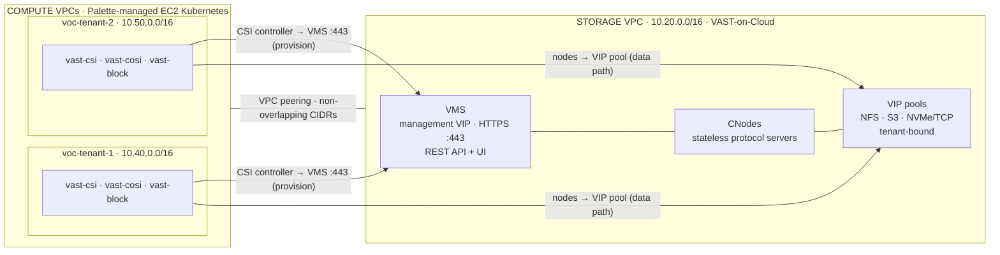
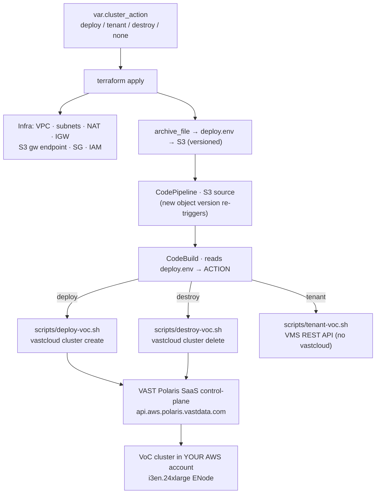
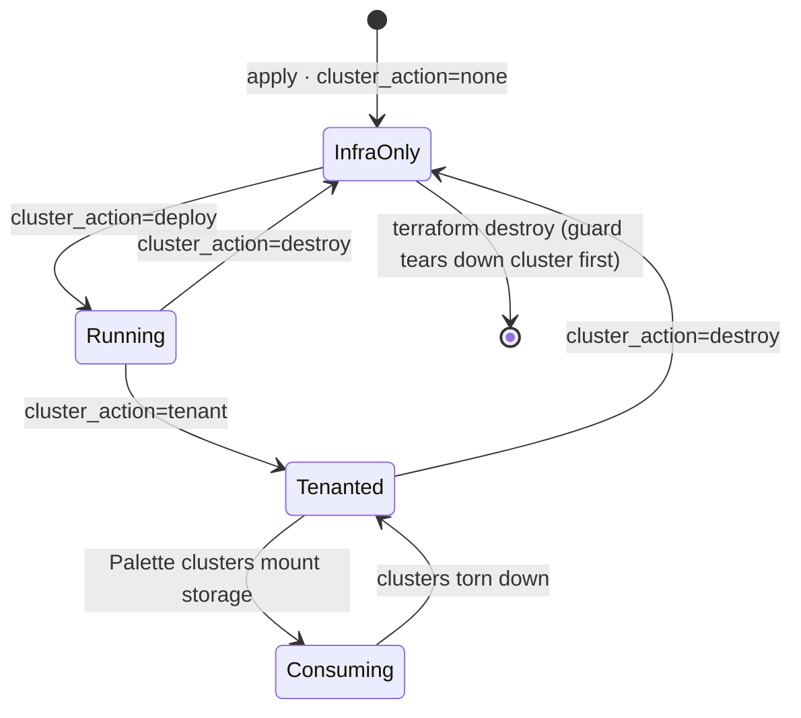
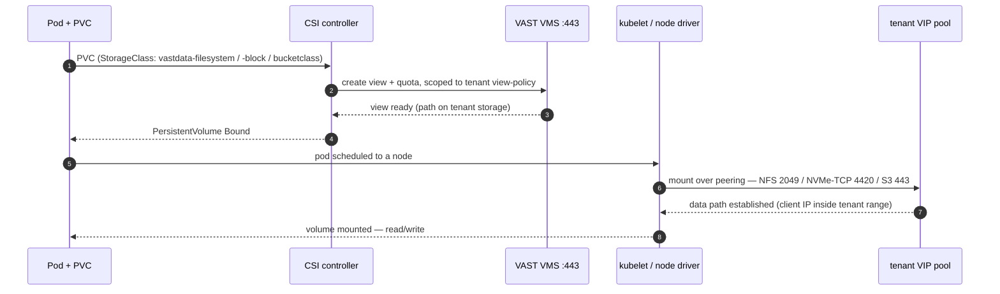
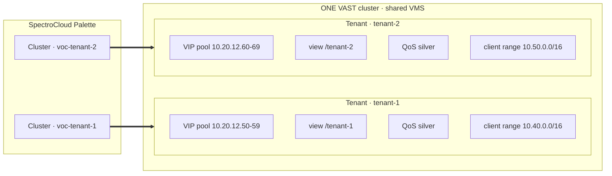
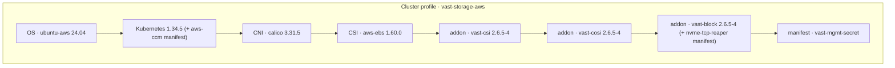
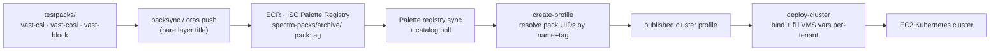
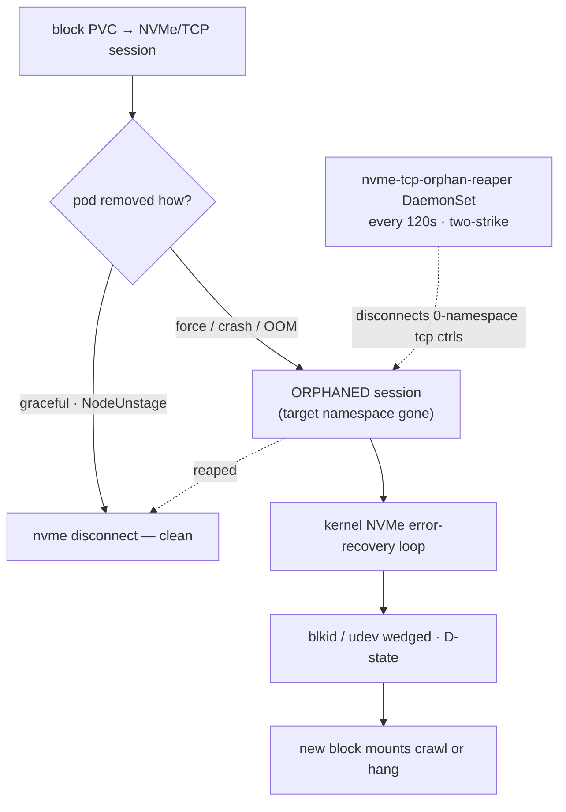

# VAST Data on SpectroCloud Palette — AWS Field-Engineering Solution

**A reproducible, multi-tenant integration that stands up VAST-on-Cloud (VoC) on AWS and consumes it from Palette-managed Kubernetes over file (NFS/CSI), object (S3/COSI), and block (NVMe/TCP) — all as code, with tenant isolation and QoS.**

- **Storage plane:** VAST-on-Cloud in its own VPC (VMS + CNodes + VIP pools), deployed via VAST Polaris + the `vastcloud` CLI, driven by AWS CodePipeline/CodeBuild — Terraform owns the connective infra, `vastcloud` owns the cluster.
- **Compute plane:** Palette-managed EC2 Kubernetes clusters in *separate*, peered VPCs, each bound to a cluster profile carrying the three VAST driver packs.
- **Isolation:** one VAST cluster, many tenants — each Palette cluster gets a dedicated VIP pool, view, QoS tier, and client-IP range.

---

## 1. Solution architecture

Two ownership domains that never cross, joined only by explicit VPC peering. Storage is long-lived infrastructure in its own VPC; compute clusters come and go around it.



**Why separate VPCs (Option B).** VAST's tenancy filters by **client IP range**, and storage outlives any single cluster — isolating it in its own VPC gives the cleanest security boundary and lets multiple clusters/tenants share one appliance. See `docs/SCOPING.md` §5.

---

## 2. Lifecycle automation — VoC as code, not click-ops

Standing up VoC is normally manual: the Polaris portal plus a hand-run `vastcloud` CLI. This turns the entire stand-up into declarative IaC — flip one variable and `terraform apply`.

### 2.1 The two-layer ownership model

| Layer | Owned by | Lifecycle | State |
|---|---|---|---|
| **Infra** — VPC · subnets · NAT · IGW · S3 gateway endpoint · SG · CodePipeline · CodeBuild · IAM | **Terraform** (your machine / CI) | `terraform apply` / `destroy` | your Terraform state (S3 + DynamoDB lock) |
| **VoC cluster** — EC2 / ASG / ENIs | **`vastcloud` CLI** (inside CodeBuild) | `cluster create` / `delete` | VAST-managed (Polaris + per-cluster `vast-cluster-<name>` S3 bucket) |

Terraform never deletes the cluster; the vast CLI never touches Terraform's infra. The flag-driven pipeline is the bridge.

### 2.2 Control flow — one flag drives the pipeline



Changing the flag changes the `deploy.env` artifact hash → the S3-sourced pipeline sees a new version → it re-runs. Pure declarative Terraform, no `null_resource`. The one imperative touch is a **`terraform_data` destroy-time guard** that fires the teardown build *before* the infra is removed, so the billing node never orphans.

### 2.3 Lifecycle states



**Cost posture:** idle = one NAT gateway (~$32/mo). A running cluster is **~$10.85/hr** (`i3en.24xlarge`, VoC's enforced minimum). Deploy → test → destroy.

---

## 3. How Kubernetes consumes VAST

### 3.1 The two reachability requirements (the crux)

1. **CSI controller → VMS REST API on `:443`** — the singleton controller creates/deletes views (each PV = a VAST view = directory + quota).
2. **Every node → VAST data VIP pool** — the per-node DaemonSet performs the actual mount.

Plus: VAST multi-tenancy filters by **client IP range** — node source IPs must fall inside the tenant's allowed range (the peered CIDR).

### 3.2 Volume provisioning — end to end



### 3.3 Protocols, drivers, and client ports

| Protocol | Driver / API | K8s surface | Access | Client ports (node → VAST) |
|---|---|---|---|---|
| **NFS file** | `csi.vastdata.com` | StorageClass `vastdata-filesystem` | RWX | 2049, 111, 20048 (+20106-8 NLM/NSM/rquota) TCP |
| **NVMe/TCP block** | `block.csi.vastdata.com` | StorageClass `vastdata-block` | RWO | 4420, 4520 (SPDK target), 8009 (discovery) TCP |
| **S3 object (COSI)** | `objectstorage.k8s.io` | BucketClass / BucketClaim | bucket-per-workload | 80 / 443 TCP |
| **VMS management** | REST + `vast-data/vastdata` TF provider | — (control) | — | 443, 80 TCP |

> **RDMA note:** there is **no RDMA path to VAST on AWS** — EFA cannot carry NFSoRDMA. The data path is high-bandwidth **TCP** (NFS `nconnect`, VIP-pool load-balancing). EFA is an *optional GPU node-to-node* capability only. See `docs/SCOPING.md` §13.

---

## 4. Multi-tenancy — one appliance, many isolated tenants

Each consuming Palette cluster maps to its own VAST tenant. Isolation is enforced at the **client-IP-range** boundary and shaped by a **QoS** tier.



### 4.1 Tenant definition (`tenants.json` → `scripts/tenant-voc.sh`)

Imperative + **idempotent**: every object is GET-by-name first and only created if absent. One entry per consuming cluster; `tenant-voc.sh` (the CodeBuild `tenant` action, VPC-attached) creates the **tenant → VIP pool → view policy → view → QoS** chain against the VMS REST API.

| Tenant | Client IP range | VIP pool | Path | QoS tier |
|---|---|---|---|---|
| `fieldeng` | 10.20.16–31 | 10.20.12.10–19 | `/fieldeng` | gold |
| `spectro` | 10.30.0.0/16 | 10.20.12.20–29 | `/spectro` | silver |
| `tenant-1` | 10.40.0.0/16 | 10.20.12.50–59 | `/tenant-1` | silver |
| `tenant-2` | 10.50.0.0/16 | 10.20.12.60–69 | `/tenant-2` | silver |

### 4.2 QoS tiers (BW / IOPS, Max + Burst)

| Tier | Read BW | Write BW | Read IOPS | Write IOPS |
|---|---|---|---|---|
| bronze | 2,000 MB/s | 1,000 MB/s | 50k | 25k |
| silver | 6,000 MB/s | 3,000 MB/s | 150k | 75k |
| gold | 20,000 MB/s | 10,000 MB/s | 500k | 250k |

VMS credentials + endpoint are delivered to each cluster as **encrypted per-cluster Palette variables** (never baked into the published profile) — the Phase-2 control-plane automation maps a Palette Project/Workspace to a VAST tenant. See `docs/VALIDATION-PLAN-RESPONSE.md` §D.

---

## 5. The cluster profile — VAST packs as Palette layers

The consuming clusters deploy from a single **cluster profile** (`vast-storage-aws`) that stacks the AWS infra layers with the three VAST driver packs plus two ride-along manifests.



### 5.1 Pack build → publish → deploy pipeline



Tooling lives in `pack_devel/`: **`packsync`** (production Go publisher, ECR/OCI + Palette sync), **`vast-profile/create-profile`** (builds+publishes the profile, resolves pack UIDs, declares the sensitive VMS variables) and **`vast-profile/deploy-cluster`** (binds a cluster, fills the per-tenant VMS values).

---

## 6. Validation — prove every protocol, per tenant

`tenant-verification/` is a self-contained kit: each manifest provisions a volume/bucket, writes a unique token, reads it back, and prints `… VERIFY: PASS` as a Kubernetes Job. Point `kubectl` at a tenant cluster and apply.

| # | Protocol | Manifest | Asserts |
|---|---|---|---|
| 1 | NFS RWX | `01-nfs.yaml` | provision + read/write over the tenant NFS VIP |
| 2 | NVMe/TCP block | `02-nvme-tcp-block.yaml` | provision + attach + read/write over the tenant block subsystem |
| 3 | S3 / COSI | `03-cosi-s3.yaml` | bucket + tenant-scoped key + PUT/LIST/GET |

Validated end-to-end on both tenant clusters: **NFS · block · S3 = PASS**.

---

## 7. Operational hardening

### 7.1 NVMe/TCP node hygiene — the orphan-reaper

A block PVC opens an NVMe/TCP session to the VAST target. An **ungraceful** pod removal (`kubectl delete --force --grace-period=0`, kubelet/node crash, OOM-kill) skips `NodeUnstageVolume`, orphaning the session — which then loops in kernel error-recovery and wedges `blkid`/udev in D-state, so *new* block mounts crawl for minutes.



**Fix (shipped, `ops/`):** the `nvme-tcp-orphan-reaper` DaemonSet (`ops/nvme-tcp-reaper.yaml`) disconnects orphaned controllers every 120s (two-strike, so it never touches a live/connecting volume) and is **baked into the `vast-block` layer of the cluster profile** — so it's on every cluster and survives redeploy. `ops/preflight-reap.sh` is a one-shot for pre-benchmark cleanup. Measured impact: a poisoned node took block mounts from ~9s → 4+ min; after reaping, back to ~9s. Operational rule: **never `--force --grace-period=0` a pod with a volume.**

### 7.2 Node prerequisites & policy

- `vast-block` needs the **`nvme-tcp` kernel module + `nvme-cli`** on the node — provided by a `preKubeadmCommands` step in the k8s pack (`infra/kubernetes.yaml`).
- The CSI **node DaemonSet needs privileged pods** — the pack values + `vast-mgmt` secret label each namespace `pod-security.kubernetes.io/enforce=privileged`.
- Control-plane pool requires **≥4 vCPU** (Palette floor) — `m5.xlarge` minimum.

---

## 8. Quickstart (VoC lifecycle)

**Prerequisites:** Terraform ≥ 1.5, AWS CLI v2, an admin AWS profile (default `fieldeng`), and a **VAST Polaris** account + login.

```bash
cd terraform
cp secrets.auto.tfvars.example secrets.auto.tfvars   # gitignored; polaris_username / polaris_password

terraform init
terraform apply -var-file=fieldeng.tfvars -var cluster_action=none     # infra + pipeline only
terraform apply -var-file=fieldeng.tfvars -var cluster_action=deploy   # CodeBuild → vastcloud cluster create (~30 min)
terraform apply -var-file=fieldeng.tfvars -var cluster_action=tenant   # tenant-voc.sh → VMS tenants/VIP-pools/views
terraform apply -var-file=fieldeng.tfvars -var cluster_action=destroy  # vastcloud cluster delete (keep infra)
terraform destroy -var-file=fieldeng.tfvars                            # guard tears down cluster, then infra
```

Consume it from a Palette cluster: publish the packs (`pack_devel/`) → build the profile (`vast-profile/create-profile`) → deploy a cluster in a peered VPC (`vast-profile/deploy-cluster`) → set up its tenant (`tenant` action) → validate (`tenant-verification/`).

---

## 9. Repository layout

```
voc/
├── docs/                    # SCOPING · VALIDATION-PLAN-RESPONSE · ENGAGEMENT-RECORD (+ rendered PDFs)
├── terraform/               # infra + CodePipeline/CodeBuild lifecycle (S3+DynamoDB state)
│   ├── network.tf · codebuild.tf · secrets.tf · vast-tenancy/
│   └── fieldeng.tfvars      # account 211476615597 · us-east-2 · 10.20.0.0/16
├── scripts/
│   ├── deploy-voc.sh · destroy-voc.sh   # vastcloud create/delete (discovery-idempotent)
│   ├── tenant-voc.sh        # VMS multi-tenancy (tenant/VIP-pool/view/policy/QoS)
│   └── validate-voc.sh      # post-deploy validation + VMS endpoint → SSM
├── tenants.json             # one entry per consuming cluster
├── buildspec.yml            # CodeBuild: install/auth tooling → run the scripts
├── pack_devel/              # VAST packs + publish/profile tooling
│   ├── packsync/ · vast-profile/ (create-profile, deploy-cluster) · testpacks/
├── tenant-verification/     # NFS / NVMe-TCP / COSI verification kit
└── ops/                     # nvme-tcp-reaper.yaml · preflight-reap.sh
```

---

## 10. Technical deep-dives (lessons from bring-up)

- **Polaris** is VAST's hosted SaaS control-plane (`api.aws.polaris.vastdata.com`). `vastcloud` logs into it; the cluster runs in **your** account. CodeBuild needs outbound internet + the login secret for any create/delete.
- **Credentials in CodeBuild:** the build authorizes via its IAM role, but `vastcloud` shells to a sanitized subprocess with no IMDS/container-cred endpoint — so the buildspec **materializes the role's short-lived session creds** into `~/.aws/credentials` per build (temporary, never committed).
- **State discovery:** a CodeBuild deploy tracks the cluster in *neither* Polaris nor persistent local state, so `cluster delete` would report "not found" and orphan a billing node. Every op uses `vastcloud cluster list --include-bucket-discovery` (scans `vast-cluster-*` S3 buckets) → deploy and destroy are both idempotent.
- **S3 gateway endpoint** is required — VoC nodes sit in private subnets and the pre-checker's S3 probe fails without it.
- **Key pair** `<cluster>-vastdata-cluster-key` must pre-exist (create's pre-checker requires it; `create` has no `--aws-key-name`).
- **Instance size:** smaller `i3en` sizes are silently unsupported — VoC enforces `i3en.24xlarge`.
- **Buildspec runs in `sh` (dash):** `set -eu`, not `set -o pipefail`; Terraform heredocs escape shell `${...}` as `$${...}`.
- **Security group** opens all VoC client ports **and** self-references for intra-cluster comms (replication / CAS / Silo).
- **CodeBuild role uses `AdministratorAccess`** (vastcloud creates VPC/EC2/CFN/S3/IAM) — scope down once the action set is pinned.
- Rotate the default VMS `admin/123456`. State contains the Polaris secret — keep the backend encrypted and private.

---

### Companion documents — [`docs/`](docs/)
- **[SCOPING.md](docs/SCOPING.md)** — AWS/EC2/Palette/VAST build mechanics, network topology decision, ports, RDMA/EFA analysis.
- **[VALIDATION-PLAN-RESPONSE.md](docs/VALIDATION-PLAN-RESPONSE.md)** — Validation-Plan answers, capability matrix, Palette→VAST control-plane automation.
- **[ENGAGEMENT-RECORD.md](docs/ENGAGEMENT-RECORD.md)** — what was delivered against the scope, phase-by-phase, with validation evidence.
- **Rendered PDFs (for sharing):** [SpectroCloud-VAST-Engagement-Record.pdf](docs/SpectroCloud-VAST-Engagement-Record.pdf) (the engagement record) · [VAST-Data-on-Kubernetes.pdf](docs/VAST-Data-on-Kubernetes.pdf) (sales-enablement one-pager).
